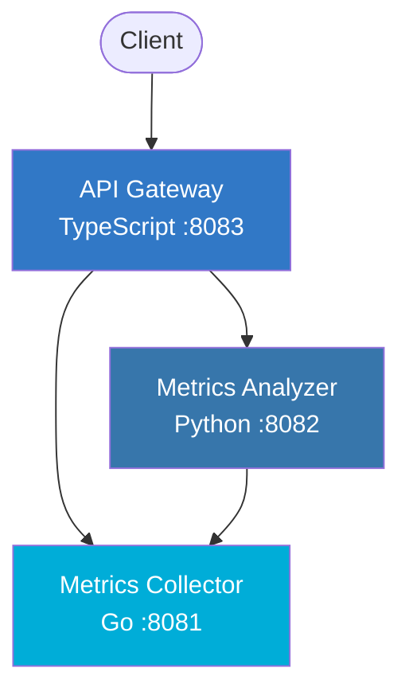

# MetriFlow

A lightweight multi-service metrics collection, analytics, and monitoring platform built with Go, Python, and TypeScript.

## Architecture



### Services

| Service | Language | Port | Description |
|---------|----------|------|-------------|
| **Collector** | Go | 8081 | Ingests and stores metric data points |
| **Analyzer** | Python | 8082 | Computes statistical analysis on collected metrics |
| **Gateway** | TypeScript | 8083 | Unified API gateway, routes requests to backend services |

## Quick Start

### Prerequisites

- Docker and Docker Compose
- Go 1.21+ (for local development)
- Python 3.12+ (for local development)
- Node.js 20+ (for local development)

### Using Docker Compose

```bash
# Copy environment config
cp .env.example .env

# Build and start all services
make up

# Check service status
curl http://localhost:8083/api/status

# Stop all services
make down
```

### Local Development

```bash
# Run all tests
make test

# Run linters
make lint

# Start individual services
cd services/collector && go run .
cd services/analyzer && pip install -r requirements.txt && python app.py
cd services/gateway && npm install && npm run dev
```

## API Reference

All endpoints are accessible through the Gateway service at `http://localhost:8083`.

### Health Check

```
GET /health
```

Response:
```json
{"status": "ok", "service": "gateway"}
```

### Service Status

```
GET /api/status
```

Returns health status of all services.

### Ingest Metrics

```
POST /api/metrics
Content-Type: application/json

[
  {"name": "cpu_usage", "value": 75.5, "tags": {"host": "server1"}},
  {"name": "memory_usage", "value": 60.0}
]
```

### Query Metrics

```
GET /api/metrics
```

Returns all stored metrics.

### Analyze Metrics

```
GET /api/analyze
```

Returns statistical analysis (count, min, max, mean, median, stdev) grouped by metric name.

### Inline Analysis

```
POST http://localhost:8082/analyze/query
Content-Type: application/json

{"values": [10, 20, 30, 40, 50]}
```

Returns computed statistics for the provided values.

## Usage Example

```bash
# Ingest some metrics
curl -X POST http://localhost:8083/api/metrics \
  -H "Content-Type: application/json" \
  -d '[
    {"name": "cpu_usage", "value": 45.2, "tags": {"host": "web-01"}},
    {"name": "cpu_usage", "value": 72.1, "tags": {"host": "web-02"}},
    {"name": "memory_mb", "value": 2048},
    {"name": "memory_mb", "value": 3072}
  ]'

# Get all metrics
curl http://localhost:8083/api/metrics

# Get analysis
curl http://localhost:8083/api/analyze
```

## Testing

```bash
# Run all tests
make test

# Run tests for individual services
make test-go
make test-python
make test-ts

# Run linters
make lint
```

## Environment Variables

See [`.env.example`](.env.example) for all available configuration options.

| Variable | Default | Description |
|----------|---------|-------------|
| `COLLECTOR_PORT` | `8081` | Port for the Go collector service |
| `ANALYZER_PORT` | `8082` | Port for the Python analyzer service |
| `GATEWAY_PORT` | `8083` | Port for the TypeScript gateway service |
| `COLLECTOR_URL` | `http://localhost:8081` | URL for the collector (used by analyzer and gateway) |
| `ANALYZER_URL` | `http://localhost:8082` | URL for the analyzer (used by gateway) |

## CI/CD

GitHub Actions workflow runs on every push and PR to `main`:

1. **Go tests** - `go vet` and `go test`
2. **Python tests** - `flake8` lint and `pytest`
3. **TypeScript tests** - `eslint`, `jest`, and `tsc` build
4. **Docker build** - Verifies all Docker images build successfully

> **Note**: The `.github/workflows/ci.yml` file may need to be manually added to the repository after the initial merge due to GitHub API restrictions on the `.github/` directory.
